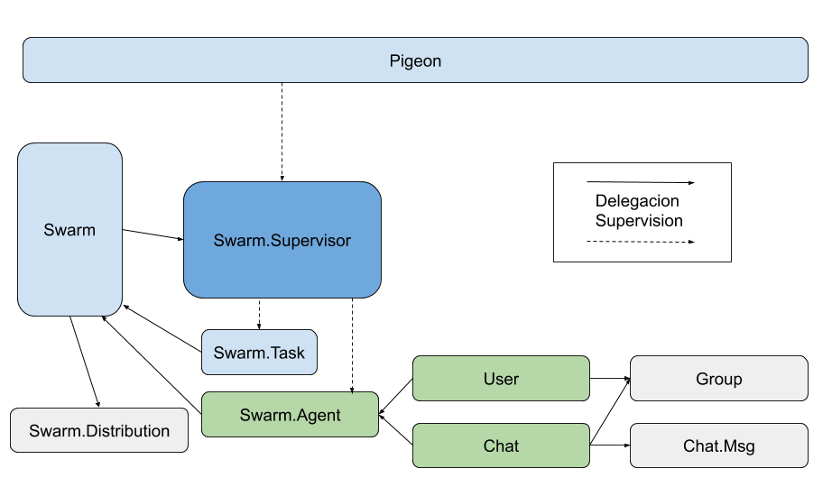

# Pigeon

_TP Grupal - IASC 2C2020_

## Diagrama

## Explicacion

Usamos `Swarm` para manejar la distribucion con una estrategia de consistent hashing ring.
Para ello creamos un `Swarm.Agent` como base que delega la supervision al `Swarm.Supervisor` la idea es de esta forma tener replicacion al iniciar un `Swarm.Agent` y agregarlo a un grupo para que las replicas se puedan comunicar por medio de PubSub.

La idea es tener un modelo de replicacion aprovechando los grupos de `Swarm` y asi poder responder a caidas de nodos partiendo del estado de una replica. Las replicas apican el algoritmo de distribusion de forma recursiva, intentando no caer en el mismo nodo.

En caso de una particion de red continuamos operando con normalidad y cuando `Swarm` detecta el heal usamos el evento `resolve_conflict` para invocar el `handle_conflict`de los `Swarm.Agent`. Los `Swarm.Agent` no son mas que una imitacion limitada de los `Agent` de elixir que se valen de `Swarm` y mapas aditivos para mantener un modelo eventualmente consistente. Por ello las bajas son solo logicas, ya que de otra forma no podriamos saber si se elimino un dato o simplemente nunca se cargo.

Para los `mensajes seguros` se creo un `Swarm.Task` que aprovecha el mismo metodo que `Swarm.Agent` pero sin replicacion para enviar un mensaje con retraso. Cada `Swarm.Task` se asocia a un id relacionado con el `Msg` que se quiere borrar, asi se quede cambiar el ttl en caso de querer hacerlo.
